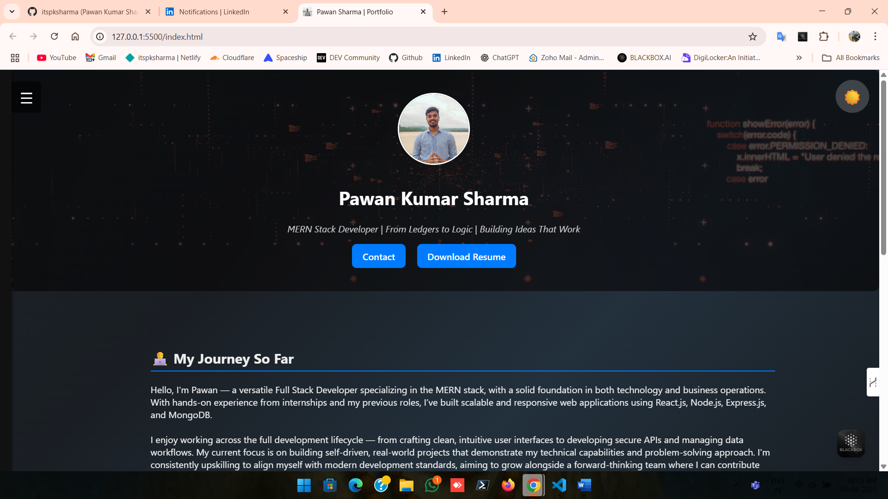
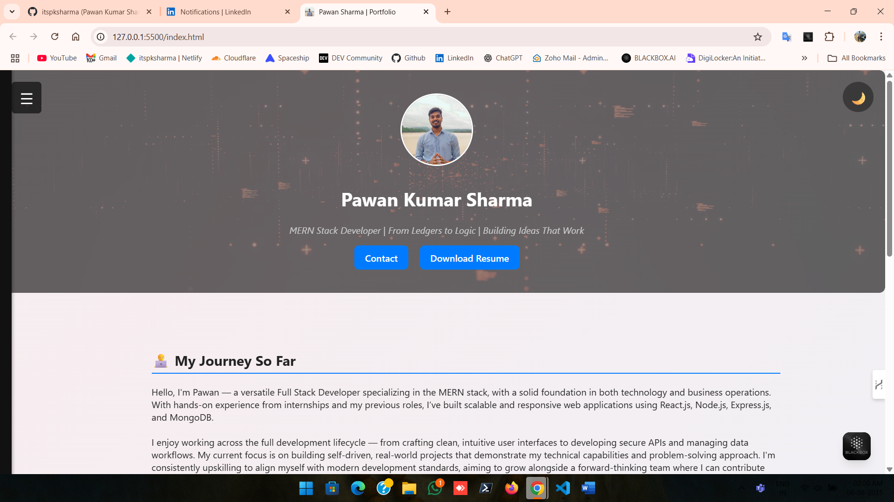
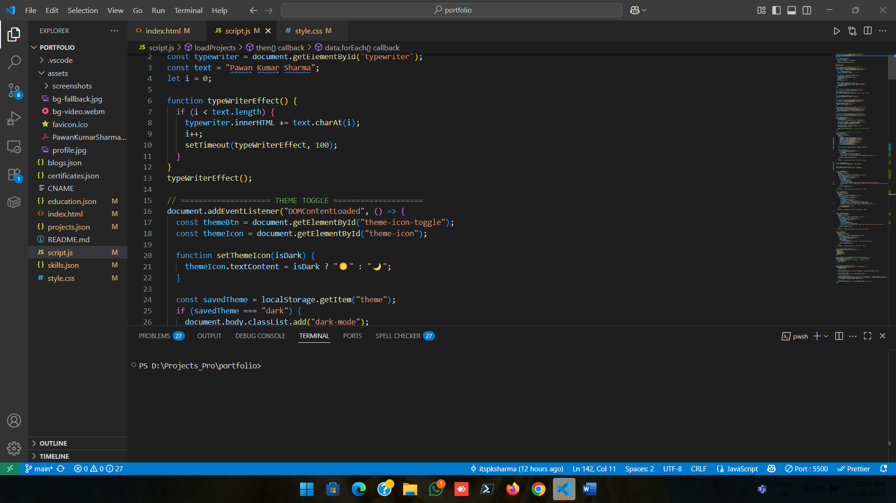
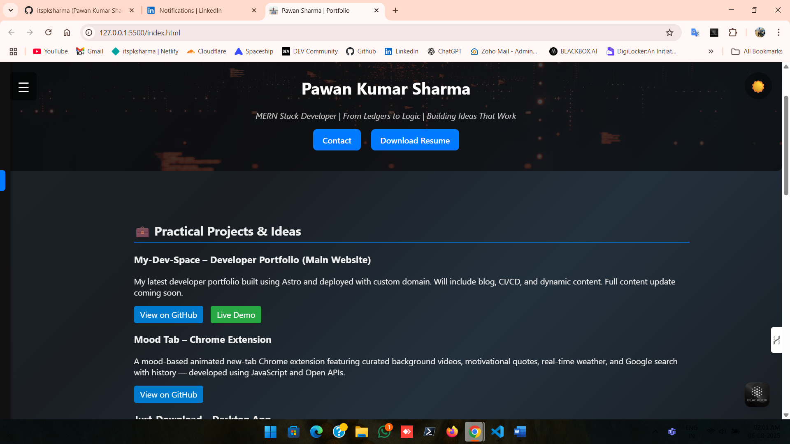
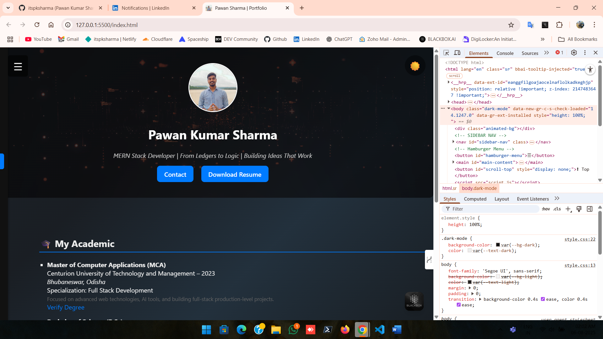
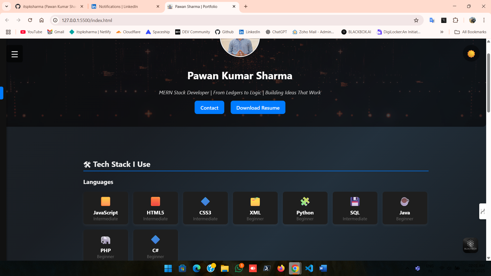
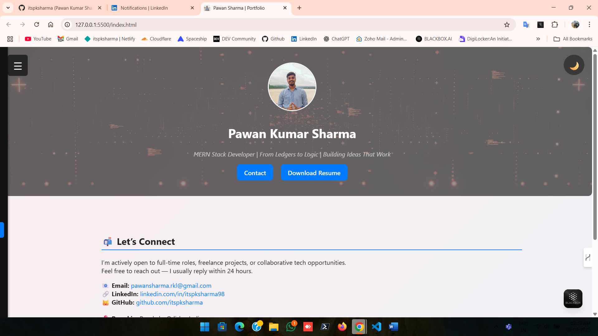
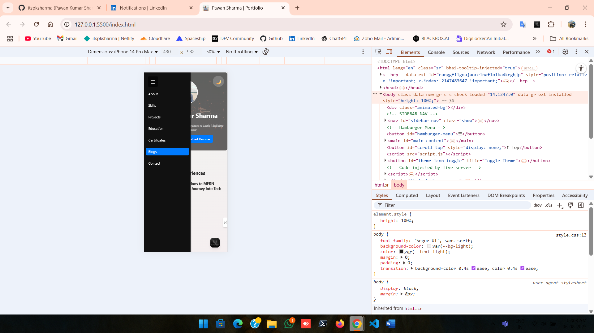
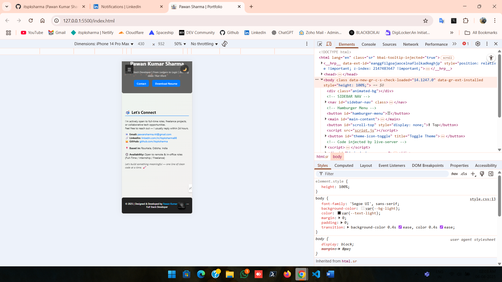
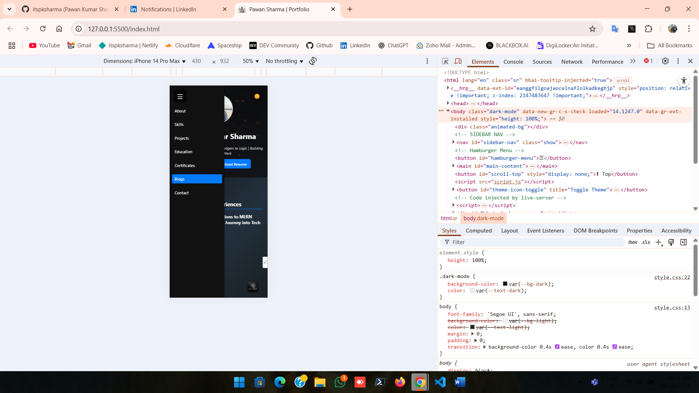

# 🧑‍💻 Pawan Kumar Sharma - Developer Portfolio

This is my fully responsive, animated, and dynamic personal portfolio website built with HTML, CSS, and JavaScript. It showcases my skills, live projects, certifications, blogs, education, and contact info in a structured card-based layout — all powered by external JSON data for easy updates.
🔗 **Live Preview**: [profile.askdevpk.me](https://profile.askdevpk.me)
---

## 🚀 Features

- 🎨 Dark/Light Theme Toggle
- 📜 Typewriter Intro Effect
- 🧾 Resume Download Button
- 📱 Responsive Layout (Mobile Friendly)
- 🧠 Skills Categorized with Icons & Grid
- 📂 Project, Blog, Certificate Cards (Dynamic via JSON)
- 🗂 Scroll Reveal Animations
- ⬆ Scroll-to-top Button
- 🔗 Social Links (LinkedIn, GitHub, WhatsApp)
- ⚙️ JSON-powered data loading
- 📸 Background video with fallback image

---

## 🛠️ Tech Stack

| Type       | Tools Used                              |
|------------|------------------------------------------|
| HTML/CSS   | Flexbox, Grid, Tailwind-like styling     |
| JS         | Vanilla JS, ScrollReveal, JSON fetch     |
| Assets     | WebM video, profile image, icons         |
| Hosting    | GitHub Pages (can use Netlify too)       |

---

## 📁 Folder Structure

my-portfolio/
│
├── index.html
├── style.css
├── script.js
├── projects.json
├── skills.json
├── education.json
├── certificates.json
├── blogs.json
├── assets/
│ ├── bg-video.webm
│ ├── bg-fallback.jpg
│ ├── profile.jpg
│ └── resume.pdf

## 📸 Screenshots

### 🔹 Home Page

### 🔹 Home Page Theme

### 🔹 Coding Part

### 🔹 Navbar

### 🔹 Projects page

### 🔹 Tab-View

### 🔹 Skills Page

### 🔹 Contact Page

### 🔹 Mobile Theme

### 🔹 Responsive Contact

### 🔹 Mobile Responsive

## 🙌 Acknowledgments

> This portfolio is part of my self-growth journey as a Full Stack Developer. Feel free to fork, clone, or get inspired for your own version.  
> For collaboration, feel free to reach out via 
[LinkedIn](https://www.linkedin.com/in/itspksharma98) or [email](mailto:pawansharma.rkl@gmail.com).

---

## 🧠 About Me

I’m a developer who believes in clean UI, meaningful backend logic, and continuous learning.  
This project reflects my approach towards structured, scalable, and practical development.

## 📌 License

This project is open-source and available under the [MIT License](LICENSE).

Thankyou - visit again
---