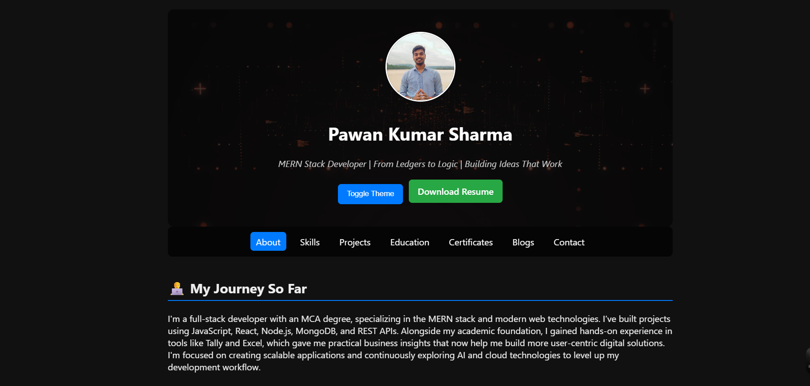
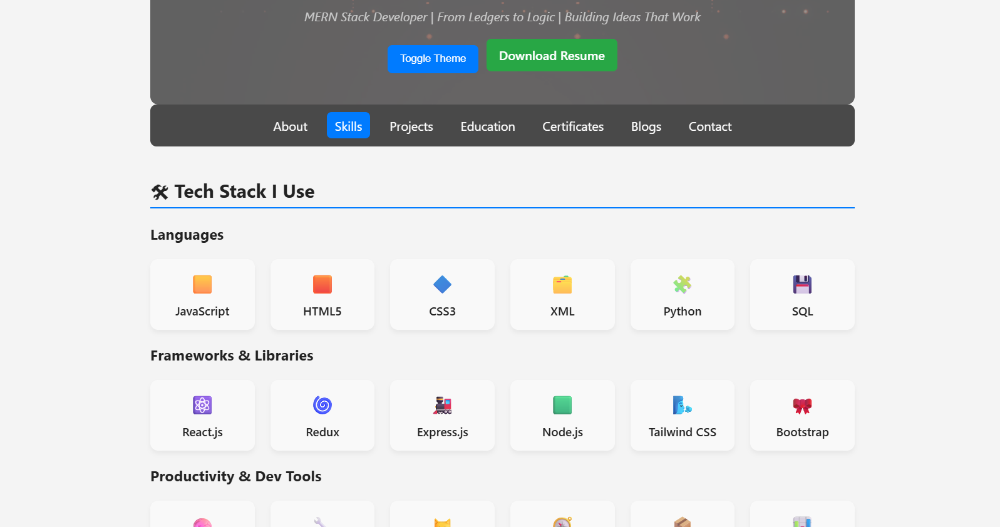
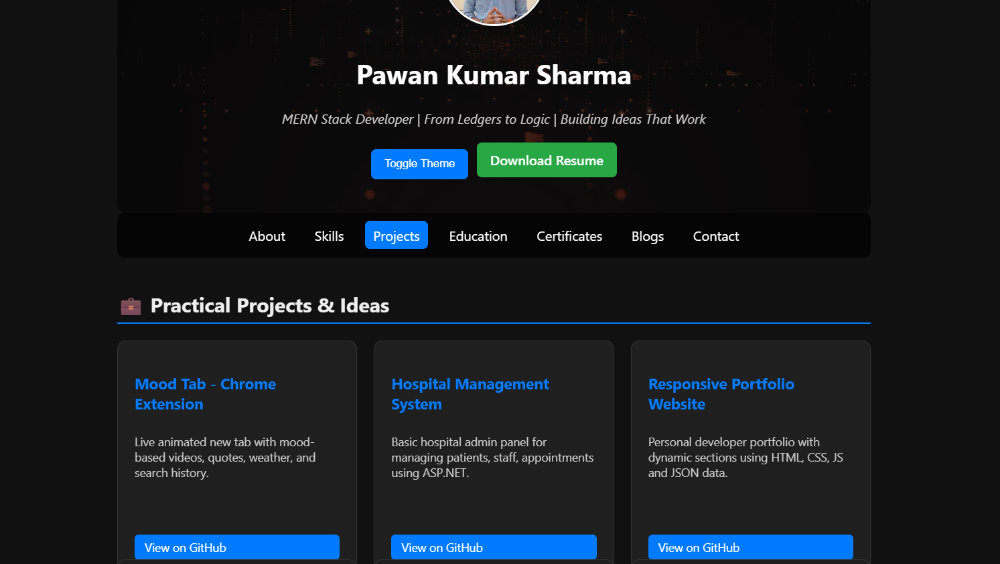
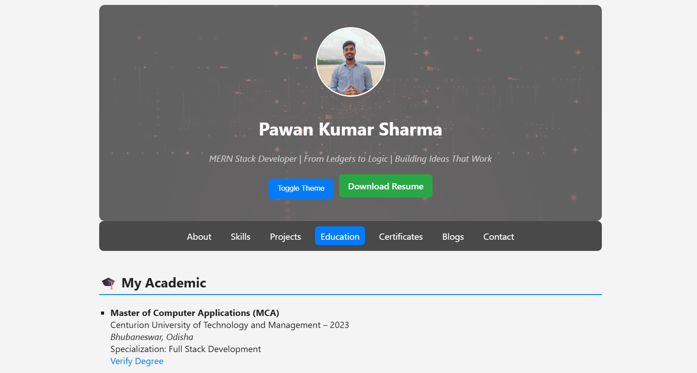
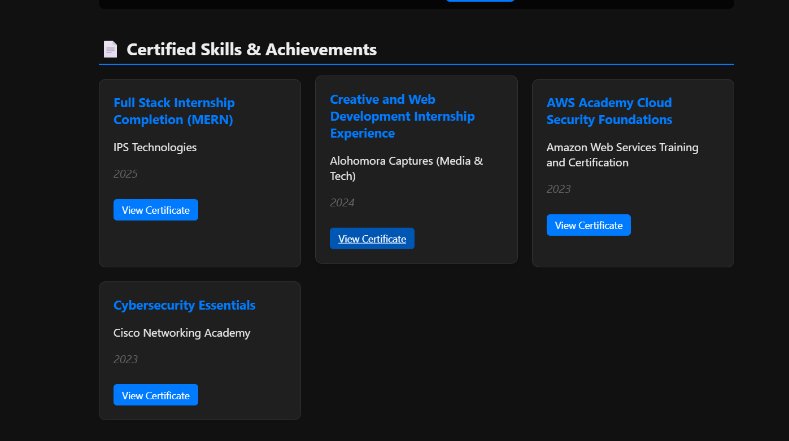
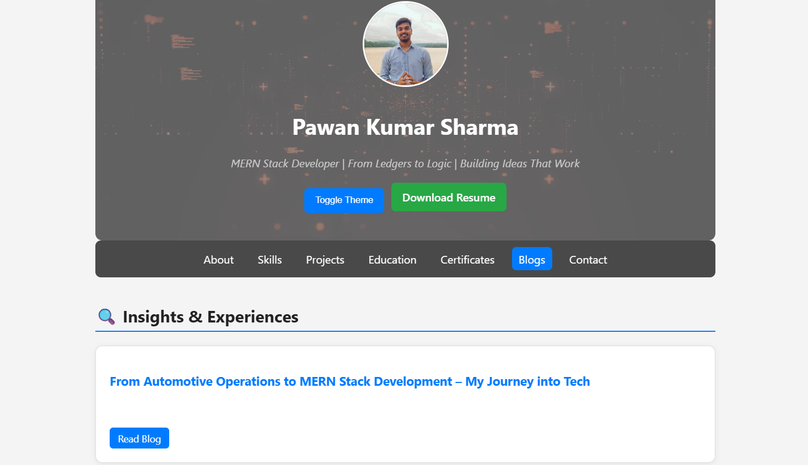
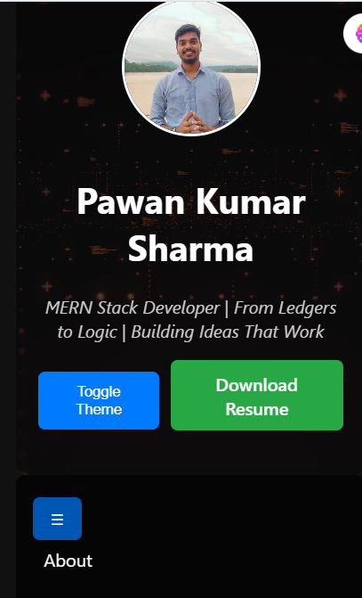

# 🧑‍💻 Pawan Kumar Sharma - Developer Portfolio

This is my fully responsive, animated, and dynamic personal portfolio website built with HTML, CSS, and JavaScript. It showcases my skills, live projects, certifications, blogs, education, and contact info in a structured card-based layout — all powered by external JSON data for easy updates.

---

## 🚀 Features

- 🎨 Dark/Light Theme Toggle
- 📜 Typewriter Intro Effect
- 🧾 Resume Download Button
- 📱 Responsive Layout (Mobile Friendly)
- 🧠 Skills Categorized with Icons & Grid
- 📂 Project, Blog, Certificate Cards (Dynamic via JSON)
- 🗂 Scroll Reveal Animations
- ⬆ Scroll-to-top Button
- 🔗 Social Links (LinkedIn, GitHub, WhatsApp)
- ⚙️ JSON-powered data loading
- 📸 Background video with fallback image

---

## 🛠️ Tech Stack

| Type       | Tools Used                              |
|------------|------------------------------------------|
| HTML/CSS   | Flexbox, Grid, Tailwind-like styling     |
| JS         | Vanilla JS, ScrollReveal, JSON fetch     |
| Assets     | WebM video, profile image, icons         |
| Hosting    | GitHub Pages (can use Netlify too)       |

---

## 📁 Folder Structure

my-portfolio/
│
├── index.html
├── style.css
├── script.js
├── projects.json
├── skills.json
├── education.json
├── certificates.json
├── blogs.json
├── assets/
│ ├── bg-video.webm
│ ├── bg-fallback.jpg
│ ├── profile.jpg
│ └── resume.pdf

## 📸 Screenshots

### 🔹 Home Section

### 🔹 Skills Section

### 🔹 Projects Section

### 🔹 Education Section

### 🔹 Certificate Section

### 🔹 Blogs Section

### 🔹 Mobile-View

